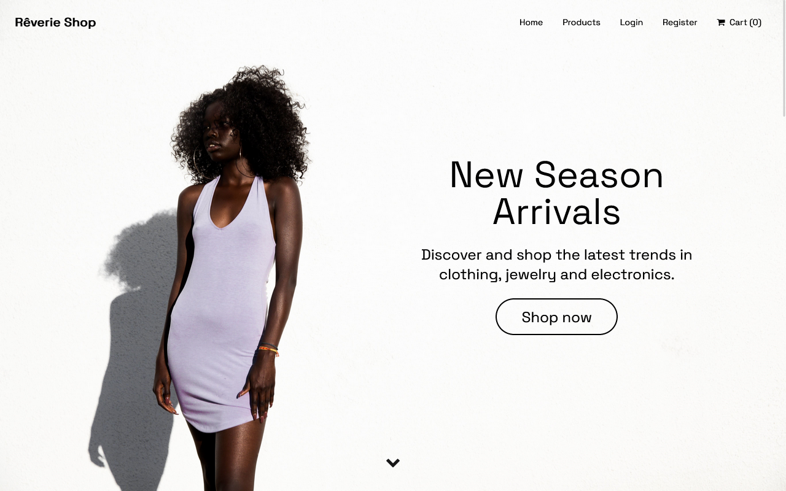
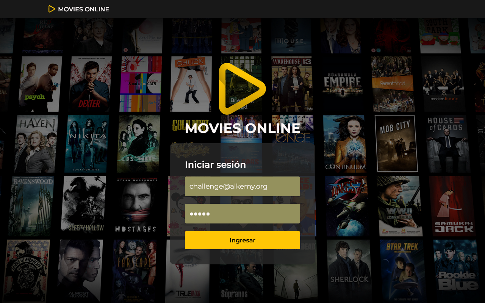
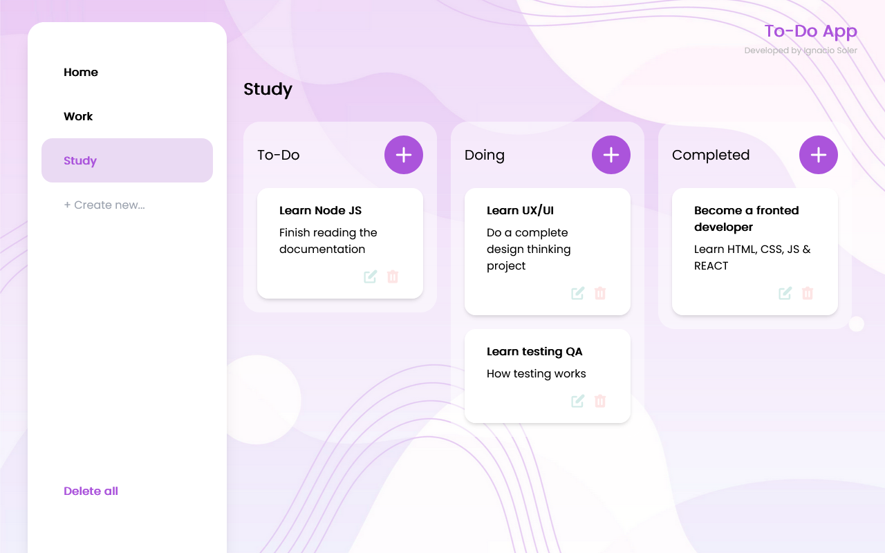

### Hola! 👋
- Soy Ignacio soler, desarrollador web. Estoy estudiando la tecnicatura de desarrollo web y apliaciones digitales en el Instituto Superior Politécnico Córdoba y realizando un bootcamp de diseño UX/UI en NUCBA. Me apasionan la tecnología y el aprendizaje constante. Acá vas a poder encontrar algunos de los proyectos en los que trabajé.

### 🧠 | Mis habilidades:
- HTML5
- CSS3
- Bootstrap
- SASS
- Tailwind CSS
- JavaScript
- Typescript
- React
- Redux
- NPM
- SQL
- Firebase
- Figma
- Adobe Xd
- Illustrator
- Photoshop
- Git/Github

### 🌱 | Estoy aprendiendo:
- Diseño UI/UX
- Testing QA
- Node JS

### 📫 | Contacto:
- Linkedin: https://www.linkedin.com/in/ignaciojsoler
- Email: ignaciojsoler@gmail.com

### 😄 | Mi Landing Page
- Mi portfolio se encuentra en desarrollo en este momento :)

### ⚡ | Mis proyectos:

###  <h3>E-commerce (2022)</h3>

E-commerce desarrollado con React JS, Redux y Firebase: 

[Repositorio](https://github.com/ignaciojsoler/ecommerce-redux)

###  <h3>Clon de Disney + (2022)</h3>

Aplicación web inspirada en Disney+ que desarrollé en Typescript para una prueba técnica: 

[Repositorio](https://github.com/ignaciojsoler/challenge-bemaster)

###  <h3>Aplicación web de películas (2022)</h3>

Aplicación web de películas que realicé utilizando la API de The Movie Database: 

[Repositorio](https://github.com/ignaciojsoler/alkemy-skillup)

###  <h3>Aplicación CRUD - Organizador de tareas (2022)</h3>

Aplicación web que desarrollé en React JS para organizar tareas: 

[Repositorio](https://github.com/ignaciojsoler/todo-app-react)

###  <h3>Krono Records (2022)</h3>

Página web que desarrollé para mi emprendimiento profesional, donde compongo música para cine y videojuegos: 

[Repositorio](https://github.com/ignaciojsoler/kronorecords-react)

###  <h3>Travel & Adventure Website (2021)</h3>

Website estático con temática de viajes y aventuras.

[Deploy](https://travelandadventure.netlify.app/) | [Repositorio](https://github.com/ignaciojsoler/travelandadventure)

###  <h3>Weather App (2021)</h3>

Aplicación web meteorológica que desarrollé utilizando la API de Open Weather:

[Deploy](https://apis-weather.netlify.app/) | [Repositorio](https://github.com/ignaciojsoler/weatherapp)

###  <h3>Discográfica (2021)</h3>

ChillJazz es una discográfica ficticia producto de mi imaginación, basada en una de mis grandes pasiones: la música

[Deploy](https://chilljazz.netlify.app/) | [Repositorio](https://github.com/ignaciojsoler/chilljazz)

<!--
**ignaciojsoler/ignaciojsoler** is a ✨ _special_ ✨ repository because its `README.md` (this file) appears on your GitHub profile.

Here are some ideas to get you started:

- 🔭 I’m currently working on ... aprender
- 🌱 I’m currently learning ...
- 👯 I’m looking to collaborate on ...
- 🤔 I’m looking for help with ...
- 💬 Ask me about ...
- 📫 How to reach me: ...
- 😄 Pronouns: ...
- ⚡ Fun fact: ...
-->
