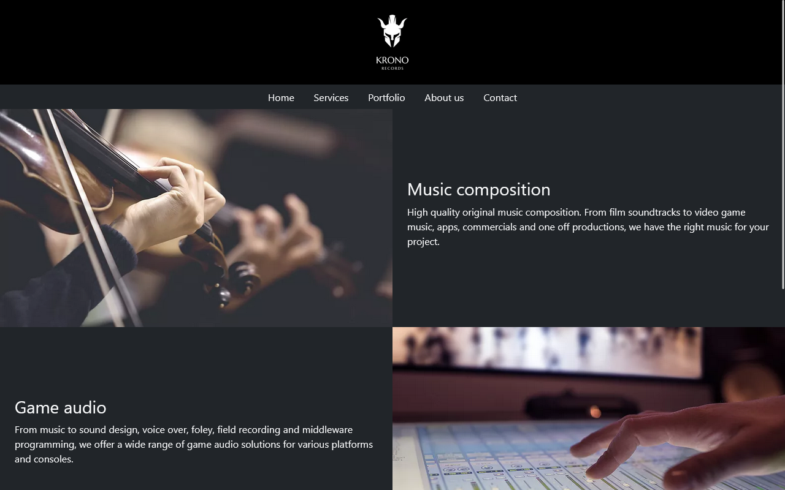

### Hola! 👋
- Soy Ignacio soler, estudiante de desarrollo web. Me apasionan la tecnología y el aprendizaje constante. Acá vas a poder encontrar los proyectos en los que estoy trabajando.

### 🧠 | Mis habilidades:
- HTML5
- CSS3
- Bootstrap
- SASS
- JavaScript
- React
- WordPress
- Figma
- Adobe Xd

### 🌱 | Estoy aprendiendo:
- Typescript
- Java
- Python

### 📫 | Contacto:
- Linkedin: https://www.linkedin.com/in/ignaciojsoler
- Email: ignaciojsoler@gmail.com

### 😄 | Mi Landing Page
- Descargá mi curriculum y accedé a todo mi portfolio directamente desde [mi página web personal](https://ignaciosoler.netlify.app/)

### ⚡ | Mis proyectos:

###  <h3>Travel & Adventure Website</h3>

Website estático con temática de viajes y aventuras.

[Deploy](https://travelandadventure.netlify.app/) | [Repositorio](https://github.com/ignaciojsoler/travelandadventure)

###  <h3>Krono Records</h3>

Página web que desarrollé para mi emprendimiento profesional, donde compongo música para cine y videojuegos: 

[Deploy](https://kronorecords.netlify.app/) | [Repositorio](https://github.com/ignaciojsoler/kronorecords/)

###  <h3>Weather App</h3>

Aplicación web meteorológica que desarrollé para practicar la interracción con APIs:

[Deploy](https://apis-weather.netlify.app/) | [Repositorio](https://github.com/ignaciojsoler/weatherapp)

###  <h3>Discográfica</h3>

ChillJazz es una discográfica ficticia producto de mi imaginación, basada en una de mis grandes pasiones: la música

[Deploy](https://chilljazz.netlify.app/) | [Repositorio](https://github.com/ignaciojsoler/chilljazz)

<!--
**ignaciojsoler/ignaciojsoler** is a ✨ _special_ ✨ repository because its `README.md` (this file) appears on your GitHub profile.

Here are some ideas to get you started:

- 🔭 I’m currently working on ... aprender
- 🌱 I’m currently learning ...
- 👯 I’m looking to collaborate on ...
- 🤔 I’m looking for help with ...
- 💬 Ask me about ...
- 📫 How to reach me: ...
- 😄 Pronouns: ...
- ⚡ Fun fact: ...
-->
